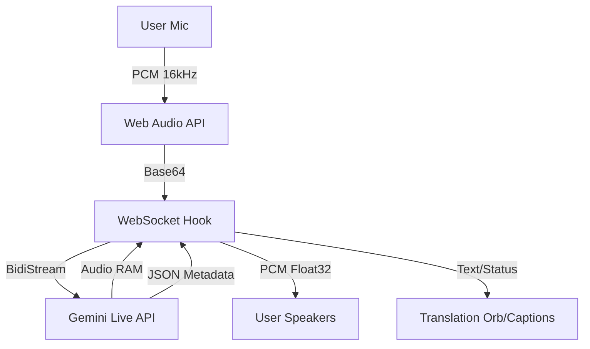

# Real-time Translation System (Gemini Live API)

## Overview

OrbitV2 implements a low-latency, real-time bidirectional translation system using the **Gemini Live API** over WebSocket. This allows for fluid, natural conversations where the AI acts as an interpreter, listening to audio, automatically detecting the language, and speaking the translation in the target language.

## Architecture

The system is built around a WebSocket connection to the Google Generative AI streaming endpoint (`BidiGenerateContent`).



## Key Components

### 1. `useGeminiLiveAudio` Hook
Located in `hooks/useGeminiLiveAudio.ts`. This is the core engine that handles:

- **Audio Capture**: Uses `navigator.mediaDevices.getUserMedia` to capture microphone input.
- **Audio Processing**: Downsamples input audio to 16kHz PCM (Linear-16) required by Gemini.
- **WebSocket Management**: Maintains the persistent connection to `wss://generativelanguage.googleapis.com/...`.
- **Response Handling**: Separates the incoming Bidi stream into:
  - **Audio Channel**: Played back immediately via Web Audio API.
  - **Text Channel**: Parsed for JSON metadata (Language detection, Confidence, Speaker ID).

### 2. Dual-Channel Protocol
To prevent the model from "reading out" technical information, we strictly enforce a dual-channel protocol via System Instructions:

- **AUDIO Channel**: The model is instructed to *only* speak the translation. It captures intonation, emotion, and nuance.
- **TEXT Channel**: The model is instructed to *only* output JSON metadata.

```json
{
  "detectedLanguage": "es",
  "confidence": 0.98,
  "isTranslation": true,
  "speaker": "Speaker 1"
}
```

### 3. Translation Memory & Context
The system injects context into the session to improve quality:

- **Glossary**: Custom terms (defined in `App.tsx`) are injected into the System Instruction to ensure specific terminology is translated correctly.
- **Context Window**: Recent transcript segments can be fed back (conceptually) to maintain conversation context.

## Integration Flow

1.  **Session Start**: `App.tsx` initializes `useGeminiLiveAudio`.
2.  **Connection**: WebSocket connects to Gemini Live. System Instructions are sent in the initial setup message.
3.  **Streaming**:
    - User speaks -> Audio chunks sent to Gemini.
    - Gemini processes -> Returns Audio (Translation) + JSON (Metadata).
4.  **Feedback**:
    - Audio is played to the user (or routed to the meeting depending on `hearOwnTranslation` setting).
    - Metadata updates the `TranslationOrb` (showing "Detected: SPANISH") and generates Captions.

## Configuration

The translation flow is configurable via `App.tsx` state:

| Setting | Description |
| :--- | :--- |
| `targetLang` | The language to translate *into* (e.g., 'es-ES'). |
| `voice` | The Gemini voice ID (e.g., 'Aoede', 'Charon'). |
| `glossary` | Key-value pairs of terms to force-translate. |

## Error Handling & Resilience

- **Reconnection**: The hook implements exponential backoff retry logic if the WebSocket disconnects.
- **Feedback Loop Prevention**: By strictly separating Audio (speech) and Text (metadata), we avoid the AI narrating its own actions.

